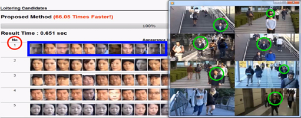

DESCRIPTION
=============

This is the repository to host the dataset used in the **AntiLoiter** paper that was published at ACM Multimedia 2016 [2].

Thumb of the **AntiLoiter** system
-------------------------------------




LOITER DATASET
--------------

The dataset is created from a synthetic surveillance dataset.
The scene contains eight cameras, each with a 1920x1080 resolution.
The footage shows actors moving across the area. They do not stop, turn around, or change their trajectory. 
One of the actors acts like a loiterer. While the actor does not stop or show an unusual trajectory, they repeatedly appear on the different cameras.
From this scene, facial features were extracted.
These facial features were then grouped together using the **Luigi** indexing method descibed in [1,2], and the visualized result of the loitering discovery system described in [3].
This dataset contains the metadata of these features.

### Format Description

The dataset is a .txt file.
Each line contains the metadata of one facial feature
Groups of facial features are seperated with a dash \-

Each feature has the following format:
```
UniqueID CameraID BeginTimestamp FrameID FrameRate Left Top Right Bottom
```
Example:
```
9310 3 1446038202 2142 29.970 567 320 643 412
```
- UniqueID: Unique identifier of the feature.
- CameraID: Identifier of the camera the feature was extracted from
- BeginTimestamp: Timestamp of start of the video footage (Unix Epoch time)
- FrameID: Number of frames since the start of the video footage
- FrameRate: Frame rate of the video camera
- Left: Bounding box top left X coordinate of the feature
- Top: Bounding box top left Y coordinate of the feature
- Right: Bounding box bottom right X coordinate of the feature
- Bottom: Bounding box bottom right Y coordinate of the feature

The timestamp of a feature can be calculated as follows:
```
BeginTimeStamp + (FrameID / FrameRate)
```

The center of a feature can be calculated as follows:
```
Center X = Left + (Right - Left) / 2
Center Y = Top + (Bottom - Top) / 2
```

### Obtaining the Dataset

If you want to use this dataset, please contact [j-liu (AT) ct.jp.nec.com](mailto:j-liu@ct.jp.nec.com).
When using this dataset, please cite the following two publications:

```
@article{LiuNAN17,
  author    = {Jianquan Liu and
               Shoji Nishimura and
               Takuya Araki and
               Yuichi Nakamura},
  title     = {A Loitering Discovery System Using Efficient Similarity Search Based
               on Similarity Hierarchy},
  journal   = {{IEICE} Transactions},
  volume    = {100-A},
  number    = {2},
  pages     = {367--375},
  year      = {2017},
  url       = {http://search.ieice.org/bin/summary.php?id=e100-a_2_367}
}

@inproceedings{LiuNA16,
  author    = {Jianquan Liu and
               Shoji Nishimura and
               Takuya Araki},
  title     = {AntiLoiter: {A} Loitering Discovery System for Longtime Videos across
               Multiple Surveillance Cameras},
  booktitle = {Proceedings of the 2016 {ACM} Conference on Multimedia Conference,
               {MM} 2016, Amsterdam, The Netherlands, October 15-19, 2016},
  pages     = {675--679},
  year      = {2016},
  url       = {http://doi.acm.org/10.1145/2964284.2970927},
  doi       = {10.1145/2964284.2970927}
}
```

### Copyright

This dataset is only allowed to use for academic research without any commercial purpose. All copyrights are reserved by the authors and original providers. This dataset is available on request to the authors of the following publications.

### Publications

1. Jianquan Liu, Shoji Nishimura, Takuya Araki, and Yuichi Nakamura. A
  loitering discovery system using efficient similarity search based on
  similarity hierarchy. *IEICE Transactions on Fundamentals of Electronics,
  Communications and Computer Sciences*, 100-A(2):367–375, 2017.
  
2. Jianquan Liu, Shoji Nishimura, and Takuya Araki. Antiloiter: A loitering
  discovery system for longtime videos across multiple surveillance cameras.
  In *Proceedings of the 24th ACM International Conference on Multimedia*
  (**ACM Multimedia**), Amsterdam, Netherlands, October 15-19, pages 675–679, 2016.
  
3. Jianquan Liu, Shoji Nishimura, and Takuya Araki. Visloiter: a system to
  visualize loiterers discovered from surveillance videos. In *Proceedings of
  the 43rd ACM SIGGRAPH Conference on Computer Graphics and Interactive
  Techniques* (**SIGGRAPH**), Anaheim, CA, USA, July 24-28, page 47, 2016.
  Posters.
